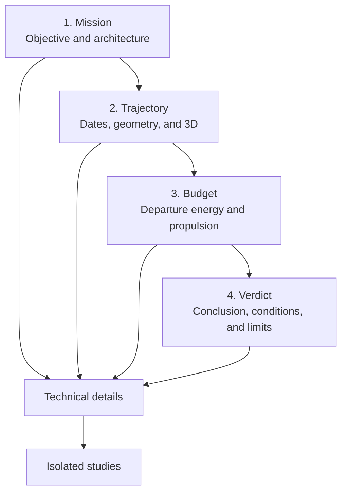
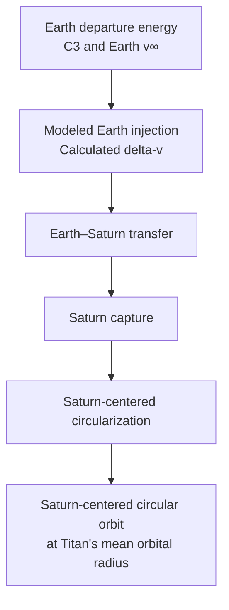

# Mission Design Calculator — UX Specification v0.3.0

## 1. Status and scope

This document is the implementation-ready UX specification for Mission Design Calculator v0.3.0. It replaces earlier UX drafts.

The application remains in English for v0.3.0. Every new user-visible string must be stored in a centralized string catalog so that localization can be added later. Do not add a language selector in v0.3.0.

The French terminology used during design remains a semantic reference only. The English strings in this document are the required visible labels for v0.3.0.

### Scientific invariants

- Do not change any internal calculation, constant, formula, or numerical pipeline.
- Do not invent scientific values, thresholds, margins, or feasibility rules.
- Do not infer compatibility with any real launch vehicle.
- Keep characteristic energy C3, hyperbolic excess velocity v∞, modeled Earth injection delta-v, Saturn maneuvers, and the complete connected total conceptually distinct.
- The final circularization is Saturn-centered at Titan's mean orbital radius.
- This circularization is not a Titan encounter, flyby, capture, or Titan-centered orbit.
- Gravity-assist demonstrators and other isolated studies do not contribute to the connected mission budget.

## 2. Product model

The primary journey contains four conceptual steps. Streamlit does not need to implement them as exactly four physical page files; secondary pages, tabs, or expanders are allowed when they make technical details and isolated studies clearer.

The modeled mission chain must be communicated as follows:

No diagram, label, or conclusion may introduce a “Titan encounter” node.

## 3. Information architecture

### 3.1 Primary navigation

1. **Mission** — objective, modeled endpoint, architecture, and principal inputs.
2. **Trajectory** — dates, duration, transfer geometry, 3D view, Saturn arrival, and launch-window exploration.
3. **Budget** — departure conditions, modeled injection, Saturn maneuvers, connected total, and simplified mass model.
4. **Verdict** — demonstrated conclusions, conditions, exclusions, and model limitations.

### 3.2 Secondary navigation

- **Technical details** — MJD2000 epochs, states and vectors, segment data, reference frames, and advanced parameters.
- **Isolated studies** — gravity-assist demonstrators, legacy Titan studies, and other calculations not connected to the active mission.

Every isolated study must display the persistent badge:

> **Not connected to the active mission**

## 4. Review of the current screens

### 4.1 Mission setup and mission scorecard

**Current function:** combines mission inputs, launch-window parameters, propulsion inputs, geometry, and top-level results.

**Problems:**

- “Mission scorecard” suggests scoring rather than scientific results.
- “Connected delta-v” hides the three baseline contributions.
- C3 and Earth v∞ are absent from the departure summary.
- “Final Saturn-centred radius” can be misread as a Titan destination.
- MJD2000 metadata is too prominent.
- Parameters and results from all four conceptual steps are mixed in one long page.
- Full-width metric cards create excessive vertical density without communicating relationships.

**Keep:** scenario identity, dates, duration, Saturn periapsis, final orbital radius, connected total, simplified mass results, and existing scientific inputs.

**Move:** dates and optimization to Trajectory; departure and propulsion quantities to Budget; conclusions to Verdict; MJD2000 to Technical details.

**Merge:** objective and architecture into Mission; repeated Titan notices into one reusable model-scope notice; related Saturn geometry controls into one advanced group.

**Remove from the primary level:** “Mission scorecard,” unexplained “connected” terminology, empty planned-capability sections, and repeated full product headings.

### 4.2 3D trajectory

**Current function:** displays and animates the sampled heliocentric Earth–Saturn trajectory.

**Problems:** “Arrival” is ambiguous; graphical interpolation can be mistaken for independent propagation; controls, legend, and timeline compete for space; the active scenario and reference frame are not prominent enough.

**Keep:** interactive 3D view, sampled positions, play/pause/reset controls, time slider, technical segment table, and methodological note.

**Change:** integrate the view into Trajectory; use “Arrival in the Saturn system”; display active scenario, dates, and duration above the view; mark the view stale after input changes; collapse the legend on narrow screens.

### 4.3 Saturn and Titan studies

**Current function:** mixes the connected Saturn arrival model with independent Saturn/Titan studies.

**Problems:** the page title conflates Saturn arrival with Titan targeting; connected and isolated calculations are mixed; Saturn maneuver contributions are not visibly reconciled with the complete connected total.

**Keep:** Saturn arrival v∞, hyperbolic geometry, Saturn capture, Saturn-centered circularization, periapsis, F-ring margin, and existing technical parameters.

**Move:** capture and circularization to Budget; arrival geometry to Trajectory or Technical details; non-connected Titan work to Isolated studies.

If the Saturn subtotal is shown, its only permitted visible label is:

> **Subtotal of modeled Saturn maneuvers**

It must never be called the connected total, total mission budget, or mission delta-v. It must never support a claimed improvement from 54.2 to 5.16.

### 4.4 Optimization

**Current function:** explores non-dominated scenarios using existing duration, connected delta-v, and simplified wet-mass results.

**Problems:** the delta-v scope is insufficiently explicit; mass may appear to be an independent objective; hovered, selected, and active points are not clearly distinguished; the display may imply unmodeled launcher capability.

**Keep:** Pareto plot, active point, existing objectives, wet-mass color encoding, and hover details.

**Change:** integrate under “Explore launch windows” in Trajectory; distinguish hovered, selected, and applied scenarios; label the delta-v axis according to the exact underlying value. If it contains the baseline value 12,530.653 m/s, it must be identified as the complete connected total, not the Saturn subtotal.

### 4.5 Gravity assists

**Current function:** presents independent Venus and Earth flyby demonstrators.

**Problems:** primary-navigation placement implies connection to the active mission; heliocentric speed gains can be misread as propulsive savings; separate demonstrators can be mistaken for a connected VEEJGA trajectory.

**Change:** move to Isolated studies and display “Not connected to the active mission.” No value from these studies may alter Earth injection, Saturn maneuvers, the connected total, mass sizing, or the verdict.

## 5. Page wireframes

### 5.1 Mission

| Zone | Content |
|---|---|
| Header | “Mission,” active scenario, and calculation status |
| Model scope | Modeled endpoint and explicit Titan exclusion |
| Objective | Earth departure, Saturn-system arrival, and final state |
| Architecture | Earth injection, transfer, Saturn capture, and Saturn-centered circularization |
| Maneuver allocation | Explanation that allocation among launcher, upper stage, and spacecraft is not modeled |
| Primary inputs | Existing inputs required by the architecture |
| Advanced inputs | Existing geometry and technical parameters, collapsed by default |
| Scenario summary | Principal inputs, calculation timestamp, and status |
| Primary action | “Calculate mission” or “Recalculate mission” |
| Next step | “Continue to Trajectory” |

Required model-scope text:

> **Modeled final state:** Saturn-centered circular orbit at Titan's mean orbital radius

> This Saturn-centered circularization is not a Titan encounter, flyby, capture, or Titan-centered orbit.

### 5.2 Trajectory

| Zone | Content |
|---|---|
| Header | “Trajectory,” active scenario, and result status |
| Dates and duration | Departure, arrival, and time of flight |
| Launch window | Search bounds, selected date, and calculation action |
| Geometry summary | Heliocentric transfer and Saturn arrival |
| Main visualization | Responsive 3D trajectory view |
| Time controls | Play, pause, reset, UTC date, and elapsed time |
| Method note | Sample interpolation is not independent propagation |
| Saturn arrival | Arrival v∞, periapsis, and existing geometry |
| Scenario exploration | Launch-window results and Pareto front |
| Technical details | Reference frame, MJD2000, and segment table |
| Next step | “Continue to Budget” |

Scenario exploration states:

- **Active scenario** — drives all four steps.
- **Hovered scenario** — temporary visual preview only.
- **Selected scenario** — awaiting explicit application.
- **Applied scenario** — becomes the active scenario.
- **Stale results** — inputs changed after the last calculation.

Required visualization note:

> Playback interpolates the sampled trajectory points. It is not an independent dynamical propagation.

### 5.3 Budget

| Zone | Content |
|---|---|
| Header | “Budget,” active scenario, and calculation scope |
| Concept note | Difference between departure energy, v∞, injection delta-v, and the connected total |
| Characteristic energy | Earth C3 |
| Hyperbolic excess speed | Earth v∞ |
| Modeled Earth injection | Calculated Earth injection delta-v |
| Allocation note | Possible future allocation to launcher, upper stage, or spacecraft |
| Modeled Saturn maneuvers | Saturn capture and Saturn-centered circularization |
| Optional subtotal | Subtotal of modeled Saturn maneuvers |
| Connected total | Complete sum of the three connected delta-v contributions |
| Simplified mass model | Existing mass inputs and results |
| Limits | Propulsion and mass-model assumptions |
| Next step | “Continue to Verdict” |

Required baseline presentation:

| Scientific category | Baseline value | Relationship to connected total |
|---|---:|---|
| Earth v∞ | approximately 10.432 km/s | Departure condition; not an additive delta-v contribution |
| Earth C3 | approximately 108.83 km²/s² | Characteristic energy; not an additive delta-v contribution |
| Modeled Earth injection | 7,381.480 m/s | Included |
| Saturn capture | 2,182.991 m/s | Included |
| Saturn-centered circularization | 2,966.182 m/s | Included |
| Subtotal of modeled Saturn maneuvers | 5,149.173 m/s | Optional subtotal; excludes Earth injection |
| Connected total | 12,530.653 m/s | Complete sum of the three maneuvers |

The baseline arithmetic must remain:

\[
7\,381.480 + 2\,182.991 + 2\,966.182 = 12\,530.653\ \mathrm{m/s}
\]

If the Saturn subtotal is displayed:

\[
2\,182.991 + 2\,966.182 = 5\,149.173\ \mathrm{m/s}
\]

Visual hierarchy:

1. Show C3 and Earth v∞ as departure conditions.
2. Show modeled Earth injection as a separate delta-v contribution.
3. Show the two Saturn maneuvers.
4. Give the complete connected total the strongest visual emphasis.
5. Give the optional Saturn subtotal secondary emphasis or omit it.

### 5.4 Verdict

| Zone | Content |
|---|---|
| Header | “Verdict,” active scenario, and calculation status |
| Main conclusion | Cautious statement limited to the current model |
| Final state | Saturn-centered orbit at Titan's mean orbital radius |
| Demonstrated budget | C3, v∞, three maneuver contributions, and connected total |
| Unmodeled allocation | Launcher, upper-stage, and spacecraft allocation is undetermined |
| Demonstrated | Outputs directly calculated by the current model |
| Not demonstrated | Real launcher compatibility, Titan encounter, connected gravity assists, and full vehicle sizing |
| Conditions | Assumptions required to interpret the conclusion |
| Model limitations | One readable and structured area |
| Traceability | Technical details and isolated studies |
| Actions | Edit mission or open details |

Required conclusion:

> The calculated scenario describes a connected Earth–Saturn mission chain within the scope and assumptions of the current model.

Required final-state text:

> The model reaches a Saturn-centered circular orbit at Titan's mean orbital radius. This result does not demonstrate a Titan encounter.

The Verdict must not contain “launchable,” “compatible with,” “feasible with,” or any comparison with a real launch vehicle.

## 6. Reusable components

1. **Step header** — step name, active scenario, and calculation status.
2. **Mission progress** — Mission → Trajectory → Budget → Verdict.
3. **Scenario summary** — identity, principal inputs, calculation time, and status.
4. **Model scope notice** — endpoint, exclusions, and Titan warning.
5. **Scientific metric card** — label, value, unit, tooltip, and category.
6. **Departure energy group** — C3 and Earth v∞.
7. **Modeled Earth injection card** — delta-v and allocation note.
8. **Connected maneuver table** — maneuver, context, value, and inclusion status.
9. **Connected total card** — visually dominant complete total and definition.
10. **Optional Saturn subtotal** — secondary presentation with locked label.
11. **Maneuver sequence** — injection, transfer, capture, and circularization.
12. **3D trajectory view** — plot, controls, timeline, legend, and synchronization status.
13. **Scenario explorer** — hovered, selected, applied, and active states.
14. **Assumptions and limitations panel** — dynamics, propulsion, mass, endpoint, and excluded studies.
15. **Scope badge** — “Connected mission,” “Technical detail,” “Isolated study,” or “Not included in connected total.”
16. **Technical-details disclosure** — collapsed by default and keyboard accessible.

## 7. Visible English strings

All strings in this section are required v0.3.0 English copy and must be centralized outside page-rendering logic.

### 7.1 Global strings

| Purpose | Visible English string |
|---|---|
| Product description | “Preliminary Earth–Saturn mission design using a deterministic first-order model.” |
| Current result state | “Results up to date” |
| Stale result state | “Inputs changed — recalculation required” |
| Running state | “Calculation in progress” |
| No result state | “No results available” |
| Isolated-study badge | “Not connected to the active mission” |
| Technical badge | “Technical detail” |
| Connected badge | “Connected mission” |
| Excluded badge | “Not included in connected total” |

### 7.2 Mission strings

| Purpose | Visible English string |
|---|---|
| Page title | “Mission” |
| Introduction | “Define the modeled objective, mission architecture, and primary inputs.” |
| Final-state heading | “Modeled final state” |
| Final-state value | “Saturn-centered circular orbit at Titan's mean orbital radius” |
| Titan warning | “This Saturn-centered circularization is not a Titan encounter, flyby, capture, or Titan-centered orbit.” |
| Architecture heading | “Modeled mission architecture” |
| Allocation note | “Allocation of Earth injection and the other maneuvers to a launcher, upper stage, or spacecraft depends on the selected architecture. This allocation is not currently modeled.” |
| Primary action | “Calculate mission” |
| Recalculation action | “Recalculate mission” |
| Next action | “Continue to Trajectory” |

### 7.3 Trajectory strings

| Purpose | Visible English string |
|---|---|
| Page title | “Trajectory” |
| Introduction | “Review the dates, duration, transfer geometry, and arrival in the Saturn system.” |
| Dates heading | “Dates and duration” |
| Window heading | “Launch window” |
| 3D heading | “3D heliocentric trajectory” |
| Arrival heading | “Arrival at Saturn” |
| Exploration heading | “Explore launch windows” |
| Method note | “Playback interpolates the sampled trajectory points. It is not an independent dynamical propagation.” |
| Departure marker | “Earth departure” |
| Arrival marker | “Arrival in the Saturn system” |
| Spacecraft marker | “Sampled spacecraft position” |
| Play control | “Play” |
| Pause control | “Pause” |
| Reset control | “Reset” |
| Legend control | “Show legend” |
| Segment control | “Show segment data” |
| Apply action | “Apply this scenario” |
| Next action | “Continue to Budget” |

### 7.4 Budget strings

| Purpose | Visible English string |
|---|---|
| Page title | “Budget” |
| Introduction | “Separate departure energy, modeled Earth injection delta-v, and the Saturn maneuvers in the connected mission chain.” |
| Departure heading | “Earth departure conditions” |
| C3 label | “Earth C3” |
| v∞ label | “Earth v∞” |
| Injection heading | “Modeled Earth injection” |
| Allocation explanation | “Allocation of this maneuver to a launcher, upper stage, or spacecraft depends on the selected architecture. No real launch vehicle is currently modeled.” |
| Saturn heading | “Modeled Saturn maneuvers” |
| Capture label | “Saturn capture” |
| Circularization label | “Saturn-centered circularization” |
| Saturn subtotal | “Subtotal of modeled Saturn maneuvers” |
| Total heading | “Connected total” |
| Total explanation | “The connected total includes modeled Earth injection, Saturn capture, and Saturn-centered circularization.” |
| Energy note | “C3 and v∞ characterize the departure energy conditions. They are not additional delta-v contributions to the connected total.” |
| Mass heading | “Simplified mass estimate” |
| Mass note | “This estimate uses the application's simplified mass model. It is not a complete vehicle design.” |
| Next action | “Continue to Verdict” |

### 7.5 Verdict strings

| Purpose | Visible English string |
|---|---|
| Page title | “Verdict” |
| Introduction | “This conclusion applies only to the calculated scenario and the scope of the current model.” |
| Conclusion heading | “Model conclusion” |
| Conclusion | “The calculated scenario describes a connected Earth–Saturn mission chain within the scope and assumptions of the current model.” |
| Final-state heading | “Calculated final state” |
| Final-state statement | “The model reaches a Saturn-centered circular orbit at Titan's mean orbital radius.” |
| Titan exclusion | “This result does not demonstrate a Titan encounter.” |
| Allocation limitation | “The current model does not determine how Earth injection or the other maneuvers are allocated among a launcher, upper stage, and spacecraft.” |
| Demonstrated heading | “What the model calculates” |
| Excluded heading | “What the model does not demonstrate” |
| Limits heading | “Model assumptions and limitations” |
| Details action | “Open technical details” |

### 7.6 Error and status strings

| State | Visible English string | Meaning |
|---|---|---|
| Input error summary | “Correct the highlighted inputs before calculating.” | A required field, format, or established input constraint is invalid |
| No numerical solution | “The inputs are valid, but the model did not produce a solution for this scenario.” | The engine returned no solution for syntactically valid inputs |
| Technical error | “The calculation could not be completed because of a technical error. Previous results were not replaced.” | Unexpected application or engine failure |
| Stale results | “Inputs have changed. The displayed results are from the previous calculation.” | Inputs no longer match the displayed results |

A feasibility conclusion (including “mission impossible,” “scientifically impossible,” or “not feasible”) is allowed if and only if:
- it is explicitly scoped (architecture, Isp, and scope of applicability);
- it cites the maneuvers and the total it derives from;
- it states the model that produces it and that model's version;
- it stays inside the study that produces it, if that study is isolated from the connected budget.

An unscoped feasibility conclusion remains prohibited.

### External review claims require the same verification as internal models

A review or critique of this application — external or internal, human or
automated — is not applied to the code or its documentation until it has
been checked against the code itself or by measurement. No claim is exempt
from this because of who or what produced it.

Two claims from an external verification review of this batch turned out
to be false and were only caught because they were checked rather than
applied directly:

- "a zero data rate zeroes out downstream Data Handling sizing" — false;
  Data Handling mass is driven by payload mass, not data rate
  (`mission/mass_model.py`).
- "commits 1 through 6 of the previous batch fail individually" — false;
  verified empirically by running the test suite against each commit in
  isolation.

This is a method, not a one-time exception: every future review claim
about this codebase — including claims in this same document — gets the
same treatment before it changes anything.

## 8. Scientific terminology and tooltips

| Scientific concept | Visible English label | English tooltip |
|---|---|---|
| Earth characteristic energy | Earth C3 | “Characteristic energy of Earth departure. For a hyperbolic departure, C3 is the square of the hyperbolic excess speed. It is not a delta-v.” |
| Earth hyperbolic excess speed | Earth v∞ | “Hyperbolic excess speed relative to Earth. It characterizes the departure state but is not itself a propulsive maneuver.” |
| Calculated Earth injection delta-v | Modeled Earth injection | “Earth injection delta-v calculated by the model. Its allocation to a launcher, upper stage, or spacecraft depends on the selected architecture.” |
| Saturn arrival hyperbolic excess speed | Saturn arrival v∞ | “Hyperbolic excess speed relative to Saturn before the capture maneuver.” |
| Saturn capture maneuver | Saturn capture | “Modeled propulsive maneuver from hyperbolic Saturn arrival into the Saturn-centered capture orbit.” |
| Saturn-centered circularization maneuver | Saturn-centered circularization | “Modeled propulsive maneuver into a circular Saturn-centered orbit at Titan's mean orbital radius. It is not a Titan encounter.” |
| Saturn maneuver subtotal | Subtotal of modeled Saturn maneuvers | “Sum of Saturn capture and Saturn-centered circularization. It excludes modeled Earth injection.” |
| Complete connected delta-v | Connected total | “Sum of modeled Earth injection, Saturn capture, and Saturn-centered circularization.” |
| Saturn-centered periapsis radius | Saturn-centered periapsis radius | “Minimum distance from Saturn's center on the relevant trajectory. It is a radius, not an altitude.” |
| Periapsis altitude | Periapsis altitude | “Distance above the reference surface. It differs from a radius measured from the body's center.” |
| Final Saturn-centered orbital radius | Final Saturn-centered orbital radius | “Distance from Saturn's center to the modeled final circular orbit.” |
| Titan mean orbital radius | Titan's mean orbital radius | “Radial reference used for the final Saturn-centered orbit. It does not imply an encounter with Titan.” |
| Simplified wet mass | Simplified wet mass | “Wet mass estimated by the simplified model, including propellant. It is not a complete vehicle design.” |
| Pareto front | Pareto front | “Set of scenarios that are non-dominated for the displayed objectives. No point is universally optimal without an additional preference.” |
| Heliocentric speed gain | Heliocentric speed gain | “Change in heliocentric speed during an isolated flyby. It is not directly a propulsive delta-v saving.” |
| MJD2000 epoch | MJD2000 epoch | “Technical epoch representation used by the calculations. Civil UTC dates remain the primary display.” |

## 9. Number and unit formatting

### 9.1 Internal values

- Preserve full internal precision.
- Never feed a formatted or rounded display value back into a calculation.
- Use one centralized formatter for each quantity family.
- Keep raw values available to technical details and tests.
- Use the repository's existing numerical tolerances for internal-value comparisons.

### 9.2 v0.3.0 English display format

- Decimal separator: period.
- Thousands separator: comma.
- Non-breaking space between a value and its unit when rendering permits it.
- UTC must remain explicit for scientific dates.
- Do not mix English and French number formats on one screen.

Required formatted baseline strings in the Budget detail view:

- `7,381.480 m/s`
- `2,182.991 m/s`
- `2,966.182 m/s`
- `5,149.173 m/s`
- `12,530.653 m/s`
- `≈10.432 km/s`
- `≈108.83 km²/s²`

### 9.3 Display precision

- Show the three connected maneuver contributions and the connected total to three decimal places together in the detailed Budget view.
- A shorter top-level summary is allowed only if the detailed value remains available.
- Keep consistent precision for quantities compared in the same group.
- C3 and v∞ may use their separately audited display precision because they are not additive terms in the connected total.

### 9.4 Exemptions from the thousands-separator rule

Thousands separators apply to physical quantities (masses, delta-v,
distances, elapsed durations). They do not apply to epoch references,
identifiers, and dimensionless indices, where domain convention takes
precedence (e.g. MJD2000). The Technical epoch reference caption on Mission
setup (`pages/mission_setup.py`) is a deliberate exemption under this rule,
not an oversight.
- Use `k` or `M` only on constrained chart axes; show the full formatted value on hover.

## 10. Visual system

### 10.1 Typography

- Use one page-level heading per screen.
- Keep the product name compact in navigation rather than repeating a large title.
- Use tabular numerals in metric groups and budget tables.
- Recommended hierarchy: 28–32 px step title, 22–24 px section title, 14–16 px metric label, 28–36 px principal value, 16 px body, and 13–14 px annotation.
- Do not render text below 12 px.

### 10.2 Color

- The existing dark visual direction may be retained.
- Use blue for navigation, selection, and the principal data series.
- Use amber for cautions and conditional interpretation.
- Use red for invalid input or technical failure.
- Use green only for states demonstrated by an existing rule.
- Use a neutral or distinct secondary treatment for isolated studies.
- Never use color as the only state indicator.
- Give the connected total stronger visual emphasis than the optional Saturn subtotal.

### 10.3 Spacing

Use an 8 px base grid: 8 px between label and value, 16 px within a group, 24 px between subsections, 40–48 px between major sections, 16 px lateral margin on narrow screens, and 32–48 px on desktop.

### 10.4 Responsive behavior

- Support widths down to 320 px.
- Stack Budget cards in scientific sequence.
- Place the connected total after all three contributions.
- Wrap 3D controls and collapse the legend on narrow screens.
- Do not require horizontal scrolling for essential content.
- Permit horizontal scrolling only for irreducible technical tables.

## 11. Acceptance criteria

### 11.1 Navigation and shared state

- [ ] The UI exposes Mission, Trajectory, Budget, and Verdict as four conceptual steps.
- [ ] The implementation does not require exactly four Streamlit page files.
- [ ] Technical details and Isolated studies remain accessible through clear secondary navigation.
- [ ] One active scenario drives all primary views.
- [ ] Editing a scientific input marks existing results as stale.
- [ ] A selected optimization point changes the active scenario only after explicit application.

### 11.2 Scientific terminology and scope

- [ ] “Launcher-provided injection” and equivalent wording do not appear.
- [ ] The visible label is “Modeled Earth injection.”
- [ ] The allocation explanation is visible in Budget.
- [ ] No real launch vehicle is described as modeled, compatible, or capable.
- [ ] C3, Earth v∞, modeled Earth injection, Saturn maneuvers, Saturn subtotal, and connected total remain distinct.
- [ ] C3 and v∞ are never added to the connected delta-v total.
- [ ] Radius and altitude are never used as synonyms.
- [ ] Gravity-assist demonstrators never modify connected results.

### 11.3 Titan and final state

- [ ] Circularization is always described as Saturn-centered.
- [ ] Titan's mean orbital radius is described as a radial reference.
- [ ] The final state is never called “Titan orbit,” “arrival at Titan,” or “Titan encounter.”
- [ ] Mission and Verdict explicitly state that the final state is not a Titan encounter.
- [ ] The 3D view uses “Arrival in the Saturn system” where “Arrival” would be ambiguous.

### 11.4 Internal numerical tests

Internal tests must compare raw numerical outputs using the numerical tolerances already defined by the repository. They must not compare rounded display strings as substitutes for numerical correctness.

- [ ] Baseline modeled Earth injection matches the existing raw result corresponding to 7,381.480 m/s within repository tolerance.
- [ ] Baseline Saturn capture matches the existing raw result corresponding to 2,182.991 m/s within repository tolerance.
- [ ] Baseline Saturn-centered circularization matches the existing raw result corresponding to 2,966.182 m/s within repository tolerance.
- [ ] Baseline connected total matches the existing raw result corresponding to 12,530.653 m/s within repository tolerance.
- [ ] If calculated or stored, the Saturn maneuver subtotal matches the raw sum of capture and circularization within repository tolerance.
- [ ] The raw connected total equals the raw sum of the three connected maneuver contributions within repository tolerance.
- [ ] No formatter changes a raw value or writes a rounded value back into application state.

### 11.5 Formatted-interface tests

UI tests must independently verify visible strings for the English v0.3.0 locale.

- [ ] The detailed Budget displays `7,381.480 m/s` for baseline modeled Earth injection.
- [ ] The detailed Budget displays `2,182.991 m/s` for baseline Saturn capture.
- [ ] The detailed Budget displays `2,966.182 m/s` for baseline Saturn-centered circularization.
- [ ] If shown, the detailed Budget displays `5,149.173 m/s` under “Subtotal of modeled Saturn maneuvers.”
- [ ] The detailed Budget displays `12,530.653 m/s` under “Connected total.”
- [ ] The Budget displays Earth v∞ as approximately `10.432 km/s`.
- [ ] The Budget displays Earth C3 as approximately `108.83 km²/s²`.
- [ ] The three contributions and complete connected total use three decimal places when shown together.
- [ ] The complete connected total has stronger visual emphasis than the optional Saturn subtotal.
- [ ] Chart hover details expose the full formatted value when an axis uses abbreviations.

### 11.6 Prohibited conclusions

- [ ] The UI makes no conclusion about compatibility with a real launch vehicle.
- [ ] It does not derive payload capability from C3.
- [ ] It does not call the Saturn subtotal the mission total or connected total.
- [ ] It never presents an improvement from 54.2 to 5.16 using the Saturn subtotal.
- [ ] It introduces no new feasibility threshold or heuristic.
- [ ] It does not subtract isolated flyby speed gains from the connected budget.

### 11.7 Verdict

- [ ] The Verdict is explicitly limited to the current model's scope and assumptions.
- [ ] It uses the complete connected total rather than the Saturn subtotal.
- [ ] It distinguishes calculated outputs from unmodeled conclusions.
- [ ] It states that maneuver allocation among launcher, upper stage, and spacecraft is undetermined.
- [ ] It states that the final state does not demonstrate a Titan encounter.

### 11.8 Error states

- [ ] Invalid input is reported next to the relevant field with corrective guidance.
- [ ] Invalid input is not labeled as a failed numerical solution.
- [ ] “The inputs are valid, but the model did not produce a solution for this scenario.” is used only after valid inputs produce no solution.
- [ ] Technical failure is distinct from invalid input and no-solution states.
- [ ] Previous valid results are not silently overwritten after failure.

### 11.9 3D trajectory

- [ ] The visualization represents the active scenario.
- [ ] Its dates match the active results.
- [ ] The interpolation note is visible or immediately accessible.
- [ ] Controls and legend do not obscure the plot.
- [ ] Controls remain keyboard accessible and usable at 320 px.
- [ ] Segment data remains accessible through Technical details.

### 11.10 Localization readiness

- [ ] v0.3.0 displays English only.
- [ ] No language selector is implemented.
- [ ] Every new visible string is stored in a centralized string catalog.
- [ ] Page-rendering logic does not duplicate or construct translatable sentences from fragments when a complete string can be used.
- [ ] Scientific symbols C3, v∞, Δv, UTC, and MJD2000 remain stable.
- [ ] Number formatting is centralized and uses the v0.3.0 English convention.

### 11.11 Non-regression

- [ ] Baseline raw outputs remain numerically equivalent within repository tolerances before and after the UX change.
- [ ] No calculation, formula, constant, or scientific pipeline is modified by the UX implementation.
- [ ] Every displayed scientific value maps to an existing model output.
- [ ] Technical details retain the available underlying precision.
- [ ] Isolated studies never alter the active connected mission state.

## 12. Delivery scope

### 12.1 Required for v0.3.0

- Four-step conceptual journey.
- Shared active-scenario state.
- English-only visible interface with centralized strings.
- No language selector.
- Explicit separation of C3, Earth v∞, modeled Earth injection, Saturn maneuvers, optional Saturn subtotal, and connected total.
- Exact preservation of baseline internal results.
- Correct English baseline formatting.
- Explicit architecture-allocation limitation.
- No launch-vehicle compatibility conclusion.
- Titan exclusion on Mission and Verdict.
- 3D view integrated into Trajectory.
- Pareto exploration linked to active-scenario state.
- Consolidated assumptions and limitations.
- Accessible technical details.
- Separate isolated studies.
- Distinct invalid-input, no-solution, and technical-error states.
- Desktop and narrow-screen layouts.

### 12.2 Later improvements without new scientific calculations

- Comparison of previously calculated scenarios.
- Scenario history and report export.
- Accessible tabular view of the Pareto front.
- Validated unit preferences.
- Light theme.
- Progressive educational explanations.
- Localized or bilingual UI after product approval.

### 12.3 Requires new scientific calculations and is excluded from v0.3.0

- Quantitative allocation among launcher, upper stage, and spacecraft.
- Comparison with a real launch vehicle or payload-performance curve.
- Titan encounter, flyby, targeting, capture, or Titan-centered orbit.
- Connected gravity-assist trajectory.
- New delta-v margins or reserves.
- Independent dynamical propagation.
- Dispersion, Monte Carlo, or probability-of-success analysis.
- Detailed vehicle mass, thermal, power, communications, or radiation models.
- Any new automatic feasibility criterion.
